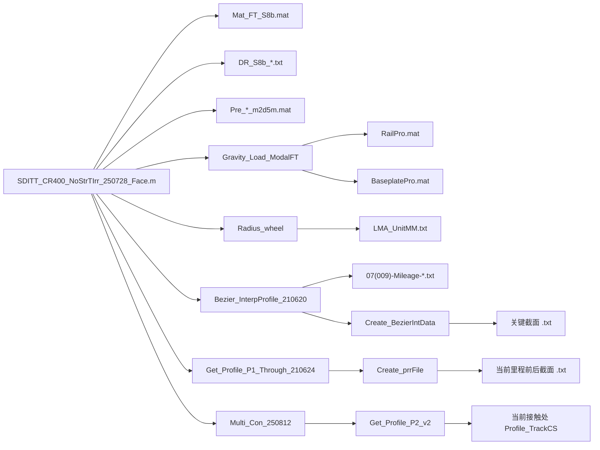

# SDITT 数据文件与依赖盘点

本文按当前主脚本 `SDITT_CR400_NoStrTIrr_250728_Face.m` 的默认执行路径盘点数据文件。重点回答：`.mat`、轮轨廓形、道岔廓形、模态文件、预平衡文件分别被谁读取。

## 默认路径摘要

当前默认配置是 `07(009)` + `FT-Modal` + `CRH380A_v6` + `NM_FW = 0`。因此正式运行会读取：

- `Mat_FT_S8b.mat`: 道岔模态缓存。
- `DR_S8b_v2_WeldAcc.txt`, `DR_S8b_v1_Crossing.txt`, `DR_S8b_v5b_Crossing.txt`, `DR_S8b_v2_WeldAcc_ReCR.txt`: 模态阻尼修正。
- `RailPro.mat`, `BaseplatePro.mat`: 轨道自重映射。
- `Pre_CRH380A_009_Face_V350_zgygPf2_m2d5m.mat`: `Cal` 阶段初始预平衡状态。
- `LMA_UnitMM.txt`: 当前车辆类型下的车轮廓形。
- `07(009)-Mileage-qjbg.txt`, `07(009)-Mileage-zjg_zgyg_250722.txt`, `07(009)-Mileage-cxg.txt`: 道岔截面里程索引。
- 上述里程索引中列出的道岔截面 `.txt` 文件，例如 `jbg-20200418-R.txt`, `07(009)-qjbg-20200418-*.txt`, `07(009)-zjg-20200418-*.txt`, `07(009)-cxg-20200422-*.txt` 等。

## `.mat` 文件

| 文件 | 读取者 | 当前默认是否读取 | 用途 |
|---|---|---:|---|
| `Mat_FT_S8b.mat` | `SDITT_CR400_NoStrTIrr_250728_Face.m` line 164 | 是 | `07(009)` 柔性道岔模态缓存，提供 `ModeFreq`, `ModeShape_Mapping`, `ModeShape`, `Pos_Node`, `N_Node`, `DOF_Node`, `Type_SpaceIron` |
| `Mat_FT_CN18_T4.mat` | 主脚本 line 168 | 否，只有 `Choose_Turnout='CN18'` | CN18 柔性道岔模态缓存；当前仓库根目录未看到该文件 |
| `RailPro.mat` | `Gravity_Load_ModalFT.m` lines 25; `Get_Mat_Abaqus_220924.m` line 8; `Get_Mat_Abaqus_CN18_250812.m` line 7 | 是，由 `Gravity_Load_ModalFT` 读取 | 钢轨节点/截面/面积等结构数据；用于轨道自重，也用于从原始模态文本生成缓存 |
| `BaseplatePro.mat` | `Gravity_Load_ModalFT.m` line 26; `Get_Mat_Abaqus_*` | 是，由 `Gravity_Load_ModalFT` 读取 | 垫板/滑床板节点、尺寸、分组；用于自重映射和模态缓存生成 |
| `SpacerIronPro.mat` | `Get_Mat_Abaqus_220924.m` line 10; `Get_Mat_Abaqus_CN18_250812.m` line 9 | 默认否 | 间隔铁数据；仅在重新从 Abaqus 文本生成 `Mat_FT_*.mat` 时读取 |
| `Pre_CRH380A_009_Face_V350_zgygPf2_m2d5m.mat` | 主脚本 line 448 | 是，`Cal` 阶段 | 正式计算起点的预平衡状态 |
| `Pre_CRH380A_009_Face_V350_zgygPf2_*.mat` | 主脚本 line 1267 写入；其中 `m2d5m` 被 line 448 读取 | 部分读取/写入 | 预平衡断点文件，保存 `Pre` 结构 |
| `FW_SDITT_230506_Mass21_v2.mat` | `Load_Rotation_FW.m` line 4 | 默认否，`NM_FW>0` 时才读取 | 柔性轮对模态和节点缓存 |
| `Par_FW_Rotation.mat` | `Load_Rotation_FW.m` line 5 | 默认否，`NM_FW>0` 时才读取 | 柔性轮对旋转附加矩阵 |
| `Sort_temp.mat` | 主脚本 lines 709-712 被注释 | 否 | 轨道不平顺缓存的历史/调试路径 |
| `BaseGapPro.mat`, `BasePro.mat`, `ConsPar.mat`, `GeoPro_CrossSect.mat`, `SlabPro.mat` | 当前默认链未发现直接读取 | 否 | 可能用于旧版建模或生成脚本 |

## 预平衡文件

| 文件 | 被谁读取/写入 | 说明 |
|---|---|---|
| `Pre_CRH380A_009_Face_V350_zgygPf2_m2d5m.mat` | 主脚本 `Cal` 阶段读取 | 固定读取的正式计算初始状态；读取后恢复 `Zwy`, `Zsd`, `Zjsd`, `Pjc`, `Pjcc`, `Pjch`, `Prhxf`, `d0`, `Con_WS`, 局部 `ZP_Con` 等 |
| `Pre_CRH380A_009_Face_V350_zgygPf2_m7d5m.mat`, `5d3m.mat`, `20m.mat`, `30m.mat`, `40m.mat`, `50m.mat`, `52d5m.mat` 等 | 主脚本 `Preload` 阶段按保存里程写入；当前主脚本只硬编码读取 `m2d5m` | 可作为其他起点，但需手动改 line 448 |

`Pre` 结构主要字段：`drtaT`, `d0`, `j1`, `Pjcc`, `Pjch`, `Prhxf`, `Zwy`, `Zsd`, `Zjsd`, `NF`, `Con_WS`, 曲线位姿状态、`drtaT_His`, `ZP_Con.RelVel_max`, `ZP_T`, `ZP_Dis`, `ZP_Vel`, `ZP_Acc`, `ZP_Load`。

## 车轮廓形

| 文件 | 读取者 | 当前默认是否读取 | 说明 |
|---|---|---:|---|
| `WRProfile-07(009)-1_18/wheel/LMA_UnitMM.txt` | `Radius_wheel.m` line 31 | 是 | `CRH380A_v6` 默认车轮廓形，文件单位为 mm，读入后除以 1000 |
| `WRProfile-07(009)-1_18/wheel/LMB10.txt` | `Radius_wheel.m` line 26 | 否，`Type_Vehicle='CR400BF'` 时读取 | CR400BF 分支 |
| `LMA.txt`, `LMB10N.txt` | `Radius_wheel.m` 中注释分支 | 否 | 历史/备选车轮廓形 |

读取后生成：

- `WheelPro_ProCS.profile_w_R`, `profile_w_L`: 左右轮二维廓形。
- `WheelPro_ProCS.Con_ang_R`, `Con_ang_L`: 接触角。
- `WheelPro_ProCS.profile_w_R_Radius`, `profile_w_L_Radius`: 曲率半径。
- 随后 `Par_Con(WheelPro_ProCS)` 补充接触参数。

## 道岔/钢轨廓形

### 路径注册

主脚本 lines 38-56 通过 `addpath` 注册廓形目录。当前 `07(009)` 分支注册：

- `WRProfile-07(009)-1_18/wheel`
- `WRProfile-07(009)-1_18/07(009)-Mileage`
- `WRProfile-07(009)-1_18/07(009)-qjbg-20200418`
- `WRProfile-07(009)-1_18/07(009)-zjg-20200418`
- `WRProfile-07(009)-1_18/07(009)-zgyg-20200424`
- `WRProfile-07(009)-1_18/07(009)-zgyg-20200509`
- `WRProfile-07(009)-1_18/07(009)-zgyg-20250720`
- `WRProfile-07(009)-1_18/07(009)-zgyg-20250722`
- `WRProfile-07(009)-1_18/07(009)-cxg-20200422`
- `WRProfile-07(009)-1_18/07(009)-cxg-20250801`

MATLAB 使用搜索路径解析同名文件；因此里程表中只保存文件名，不保存完整路径。

### 里程索引文件

| 文件 | 读取者 | 当前默认是否读取 | 对应结构 |
|---|---|---:|---|
| `07(009)-Mileage-qjbg.txt` | `Bezier_InterpProfile_210620.m` lines 16-24 | 是 | `InpPar.Mileage_sum.R1` |
| `07(009)-Mileage-zjg_zgyg_250722.txt` | `Bezier_InterpProfile_210620.m` lines 27-36 | 是 | `InpPar.Mileage_sum.R2` |
| `07(009)-Mileage-cxg.txt` | `Bezier_InterpProfile_210620.m` lines 39-48 | 是 | `InpPar.Mileage_sum.R3` |
| `07(009)-Mileage-cxg-250801.txt`, `07(009)-Mileage-zjg_zgyg.txt`, `07(009)-Mileage-zjg_zgyg_250720.txt` | 注释或备选 | 否 | 备选索引 |
| `CN18-Mileage-zjbg.txt`, `CN18-Mileage-qjbg.txt`, `CN18-Mileage-zjg_zgyg.txt`, `CN18-Mileage-cx.txt` | `Bezier_InterpProfile_CN18_250813.m` | 否，CN18 分支才读取 | CN18 里程索引 |

### 截面廓形文件

| 类别 | 读取者 | 当前默认是否读取 | 文件来源 |
|---|---|---:|---|
| 固定/起始廓形 | `Get_Profile_P1_Through_210624.m` line 36 | 是 | `InpPar.Mileage_sum.R1{1,2}`，当前可解析到 `07(009)-Mileage-qjbg.txt` 中的 `jbg-20200418-R.txt` |
| Bezier 建模输入 | `Create_BezierIntData.m` line 40 | 是 | `InpPar.Mileage_sum.R1/R2/R3` 中列出的所有关键截面 `.txt` |
| 当前里程前后截面 | `Create_prrFile.m` lines 21, 40, 62-63 | 是 | 当前轮对里程两侧的截面 `.txt`，由里程索引决定 |
| 每步当前钢轨廓形 | `Get_Profile_P1_Through_210624.m` lines 76, 84, 88 | 是 | 调用 `Create_prrFile` 生成 `R1/R2/R3` 当前截面 |
| 接触处最终轨廓 | `Get_Profile_P2_v2.m` 被 `Multi_Con_250812.m` line 86 调用 | 是 | 对 `RailPro_ProCS` 叠加钢轨动态位移和不平顺后得到 `Profile_TrackCS` |

典型索引关系：

- `R1`: `07(009)-Mileage-qjbg.txt`，包含 `jbg-20200418-R.txt` 和 `07(009)-qjbg-20200418-*.txt`。
- `R2`: `07(009)-Mileage-zjg_zgyg_250722.txt`，包含 `07(009)-zjg-20200418-*.txt`，后续也会关联尖轨/直股翼轨相关截面。
- `R3`: `07(009)-Mileage-cxg.txt`，包含 `07(009)-cxg-20200422-*.txt`。

`.prr` 文件在当前主流程中不直接读取；当前计算使用 `.txt` 廓形。`.prr` 多由各廓形目录中的 `fun_txt2prr.m` 或 `turnouts_*.m` 生成，供 SIMPACK/外部工具使用。

## 模态文件

### 当前默认读取的模态缓存

| 文件 | 读取者 | 说明 |
|---|---|---|
| `Mat_FT_S8b.mat` | 主脚本 line 164 | 默认直接读取。它已经封装了 Abaqus/Ansys 原始模态结果，不再逐个读 `.rpt` 或 `Modefile_*.txt`。 |

主脚本读取后把变量复制到 `InpPar.ModeFreq`, `InpPar.ModeShape_Mapping`, `InpPar.ModeShape`, `InpPar.Pos_Node`, `InpPar.N_Node`, `InpPar.DOF_Node`, `InpPar.Type_SpaceIron`。

### 阻尼比文本

| 文件 | 读取者 | 当前默认是否读取 | 用途 |
|---|---|---:|---|
| `DR_S8b_v2_WeldAcc.txt` | 主脚本 line 201 | 是 | 初始典型阻尼比集合 |
| `DR_S8b_v1_Crossing.txt` | 主脚本 line 224 | 是 | 辙叉相关阻尼比覆盖/补充 |
| `DR_S8b_v5b_Crossing.txt` | 主脚本 line 241 | 是 | FRF 相关阻尼比覆盖/补充 |
| `DR_S8b_v2_WeldAcc_ReCR.txt` | 主脚本 line 256 | 是 | CR 影响修正 |
| `DR_S8b_v3_Crossing.txt`, `DR_S8b_v4_Crossing.txt`, `DR_S8b_v3_WeldAcc.txt` | 注释或未引用 | 否 | 历史/备选阻尼数据 |

这些数据合并为 `DR_Typical`，再与脚本内构造的 `DR_Normal` 一起传给 `Matrix_Modal_FT_230313`。

### 原始模态导入路径

默认不走，但代码保留了从原始有限元输出生成 `Mat_FT_*.mat` 的路径：

| 函数 | 原始文件 | 当前默认是否读取 | 说明 |
|---|---|---:|---|
| `Get_Mat_Abaqus_220924.m` | `AllRailsPlates_S1_<DOF>.rpt`, `EigenFrequency_S1.txt`, `RailPro.mat`, `BaseplatePro.mat`, `SpacerIronPro.mat` | 否 | `07(009)` Abaqus 原始模态导入，主脚本相关调用被注释 |
| `Get_Mat_Abaqus_CN18_250812.m` | `AllRails_CN18_T4_<DOF>.rpt`, `AllBaseplates_CN18_T4_<DOF>.rpt`, `AllSpacerIron_CN18_T4_<DOF>.rpt`, `EigenFrequency_T4_250812.txt`, `RailPro.mat`, `BaseplatePro.mat`, `SpacerIronPro.mat` | 否 | CN18 原始模态导入 |
| `Get_Mat_Ansys_220924.m` | `NodePos_PT-220709.txt`, `Modefile_PT-220709_SolidSlab_FreqModal.txt`, `Modefile_PT-220709_SolidSlab_Mode*.txt` | 否 | 旧版 Ansys 导入路径 |
| `Load_ModeShape_FW.m` | `NodePos_FW_SDITT_MASS21_220608.txt`, `ELIST.lis`, `Modefile_FW_SDITT_220608_MASS21_*.txt`, `NLIST_Trend_Lat.lis`, `HBFILE_*` | 否 | 柔性轮对模态生成缓存；当前 `NM_FW=0` 不用 |
| `Load_Rotation_FW.m` | `FW_SDITT_230506_Mass21_v2.mat`, `Par_FW_Rotation.mat` | 否 | 若启用柔性轮对，读取已生成的轮对模态缓存 |

本仓库根目录当前没有看到 `.rpt`, `Modefile_*.txt`, `EigenFrequency_*.txt`, `NodePos_*.txt`, `HBFILE_*` 等原始模态输入文件；默认运行依赖的是已经存在的 `Mat_FT_S8b.mat` 缓存。

## 轨道不平顺文件

当前主脚本直接构造零不平顺，没有读取外部不平顺文件：

```matlab
InpPar.TIrr = zeros(2,9);
InpPar.TIrr(:,1) = [-1000; 1000];
InpPar.d_TIrr = InpPar.TIrr;
```

备选但默认不走：

- `Load_TIrr.m` 会读 `TrackIrr_WhiteNoise_5To2000Hz_160km_0.01mm.txt`。
- `TIrr_WideFreq.m` / `TIrr_WideFreq_v2.m` 会 `readtable` 指定 Excel/表格文件的 `TIrr_FZ` sheet。
- `TIrr_WideFreq_v3.m` 会读指定文本或 `.mat` 宽频不平顺数据。

## 主要输出文件

| 文件 | 写入者 | 内容 |
|---|---|---|
| `Pre_CRH380A_009_Face_V350_zgygPf2_<里程>.mat` | 主脚本 line 1267 | 预平衡断点 `Pre` 结构 |
| `CRH380A_009_Face_V350_zgygPf2.mat` | 主脚本 line 1292 | 正式计算后的完整工作区结果 |
| `FW_SDITT_230506_Mass21_v2.mat` | `Load_ModeShape_FW.m` line 277 | 柔性轮对模态缓存；只有手动运行生成函数时写入 |

## 调用关系速查


