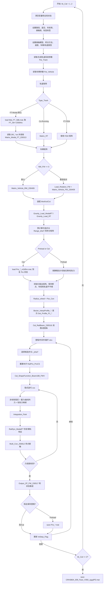

# `SDITT_CR400_NoStrTIrr_250728_Face.m` 主流程

本文整理当前主脚本 `SDITT-RW-FT-250728/SDITT_CR400_NoStrTIrr_250728_Face.m` 的执行流程、主要输入、状态变量与输出。结论按当前默认配置说明：`07(009)` 道岔、`Face` 行车方向、`CRH380A_v6`、`FT-Modal` 轨道模型、刚性轮对、无轨道不平顺。

## 入口与两阶段运行

主脚本最外层是 `for kk_Cal = 1:1:2`。每轮都会清空变量并重新初始化：

- `kk_Cal == 1`: `InpPar.Type_simulation = 'Preload'`，执行预平衡/预运行，并按里程断点保存 `Pre_CRH380A_009_Face_V350_zgygPf2_*.mat`。
- `kk_Cal == 2`: `InpPar.Type_simulation = 'Cal'`，读取 `Pre_CRH380A_009_Face_V350_zgygPf2_m2d5m.mat` 作为初始状态，执行正式仿真，最终保存 `CRH380A_009_Face_V350_zgygPf2.mat`。

## 当前默认配置

| 类别 | 默认值 | 位置 |
|---|---:|---|
| 道岔 | `InpPar.Choose_Turnout = '07(009)'` | line 17 |
| 行车方向 | `InpPar.VehicleDir = 'Face'` | line 124 |
| 车速 | `InpPar.Vlc = 350/3.6` m/s | line 118 |
| 车辆 | `InpPar.Type_Vehicle = 'CRH380A_v6'` | line 133 |
| 轨道模型 | `InpPar.Type_Track = 'FT-Modal'` | line 112 |
| 柔性轮对模态数 | `InpPar.NM_FW = 0` | line 304 |
| 法向接触 | `STRIPES&ConDamp` | line 87 |
| 接触阻尼 | `Hu-Guo`, `0.83` | lines 90-91 |
| 积分方法 | `Park` | line 105 |
| 轨道不平顺 | 全零矩阵 `InpPar.TIrr` | lines 683-687 |
| 道岔模态截断频率 | `CutFreq_FT = 2000` Hz | line 192 |

## 总体流程图

## 主要输入

| 输入类 | 当前默认来源 | 进入方式 |
|---|---|---|
| 主控制参数 | 脚本内硬编码 `InpPar` | 直接赋值 |
| 轨道/车辆参数 | `Par_TrackSystem`, `Par_Vehicle_CRH380A_v6` | 函数返回 |
| 柔性道岔模态数据 | `Mat_FT_S8b.mat` | `load` |
| 模态阻尼修正 | `DR_S8b_v2_WeldAcc.txt`, `DR_S8b_v1_Crossing.txt`, `DR_S8b_v5b_Crossing.txt`, `DR_S8b_v2_WeldAcc_ReCR.txt` | `load` |
| 轨道重力相关几何 | `RailPro.mat`, `BaseplatePro.mat` | `Gravity_Load_ModalFT` 内 `load` |
| 预平衡初始状态 | `Pre_CRH380A_009_Face_V350_zgygPf2_m2d5m.mat` | `Cal` 阶段 `load` |
| 车轮廓形 | `LMA_UnitMM.txt` | `Radius_wheel` 内 `load` |
| 道岔里程-截面索引 | `07(009)-Mileage-qjbg.txt`, `07(009)-Mileage-zjg_zgyg_250722.txt`, `07(009)-Mileage-cxg.txt` | `Bezier_InterpProfile_210620` 内 `fopen/textscan` |
| 道岔截面廓形 | 里程表中列出的 `.txt` 截面文件 | `Create_BezierIntData`, `Create_prrFile`, `Get_Profile_P1_Through_210624` 内 `load` |
| 轨道不平顺 | 当前为全零 | 脚本直接构造 |

## 核心状态变量

| 状态变量 | 含义 | 更新位置 |
|---|---|---|
| `InpPar` | 全局配置、轨型、接触斑、模态、廓形、轨道不平顺、轨梁几何等 | 全流程持续扩展 |
| `Par_Track`, `Par_Vehicle`, `Par_FW` | 轨道、车辆、柔性轮对参数 | 初始化阶段 |
| `Mxt`, `Kxt`, `Cxt` | 总系统质量、刚度、阻尼矩阵 | 轨道/车辆矩阵装配，非线性阻尼会更新 `Cxt` |
| `Zwy`, `Zsd`, `Zjsd` | 位移、速度、加速度历史列，供积分法使用 | 初始状态、每步积分后推进 |
| `Pxt` | 总外力向量 | 每次隐式迭代重建 |
| `Pjc`, `Pjcc`, `Pjch`, `Prhx`, `Prhxf` | 法向接触、接触阻尼、切向力及轮轨力缓存 | `Multi_Con_250812` 和误差检查 |
| `Con_WS` | 每个轮对的接触几何与接触力结构 | `Multi_Con_250812` 后保存 |
| `Con_Int` | 当前步隐式迭代中的接触/轨道响应缓存 | `Define_Con_Int`, `Storage_Iteration_*` |
| `RailPro_ProCS`, `WheelPro_ProCS` | 当前轮对位置对应的钢轨/车轮廓形、曲率、接触角 | 廓形准备与每个步长重建 |
| `ShapeFunction`, `RailBeam_Motion` | 柔性道岔模态到接触点的映射 | 每个候选步长重算 |
| `Dis_Rail`, `Vel_Rail`, `Acc_Rail`, `DynStatus_Rail` | 接触点处钢轨位移、速度、加速度/动态状态 | `RailDyn_ModalFT` |
| `ZP_Dyn`, `ZP_Con`, `ZP_Int` | 动力学、接触、迭代过程输出结构 | 初始化后持续填充 |
| `ZP_Dis`, `ZP_Vel`, `ZP_Acc`, `ZP_Load`, `ZP_NF` | 步级位移、速度、加速度、载荷、法向力矩阵 | 每个收敛步保存 |
| `drtaT_His`, `i_drtaT_PreviousStep` | 变步长积分历史与下一步初始候选步长 | 每步推进 |
| `ZP_IntError_Nor`, `ZP_IntError_NorTan` | 法向力和合力收敛误差 | 每次隐式迭代 |

## 每个里程步的计算逻辑

1. 根据上一时间步误差、历史步长和轮对所在里程选择候选步长 `i_drtaT`。
2. 试算 `T = T_old + drtaT`、`j1 = j1_old + Vlc * drtaT`。
3. 读取/插值得到当前接触位置的 `RailPro_ProCS`。
4. 计算梁单元形函数和接触点附近轨梁运动。
5. 在 `xcs` 隐式迭代中：
   - 更新车辆非线性阻尼。
   - 加重力、曲线外力、非线性悬挂力。
   - 将上一轮轮轨力映射到车辆与轨道系统。
   - 调用 `Integration_Park` 得到新的系统响应。
   - 由模态坐标恢复钢轨动态响应。
   - 调用 `Multi_Con_250812` 重新计算多点接触几何、法向力、接触阻尼、切向力。
   - 用 `Pjc` 和 `Prhxf/Pjch/Pjcc` 计算收敛误差。
6. 若当前步长不收敛，进入更小的 `drtaT` 候选；若收敛，写入 `ZP_*` 输出并推进状态历史。

## 输出

| 输出 | 产生条件 | 内容 |
|---|---|---|
| `Pre_CRH380A_009_Face_V350_zgygPf2_<里程>.mat` | `Preload` 阶段且 `Choose_Save == 1`，经过指定里程断点 | `Pre` 结构，包含位移/速度/加速度历史、轮轨力、接触状态、断点前若干步输出 |
| `CRH380A_009_Face_V350_zgygPf2.mat` | `kk_Cal == 2` 正式计算结束 | 主工作区结果，包含 `InpPar`, 参数、矩阵摘要、`ZP_Dyn`, `ZP_Con`, `ZP_Dis`, `ZP_Vel`, `ZP_Acc`, `ZP_Load`, `ZP_NF` 等 |
| 实时图和进度条 | 运行时 | `Plot_Con`, `PlotPost`, `waitbar` |

## 需要注意的分支

- 当前文件名含 `NoStrTIrr`，实际也走了无不平顺分支：`InpPar.TIrr` 是两行零矩阵。
- `CN18` 分支存在，但当前默认不会走；它会读取 `Mat_FT_CN18_T4.mat` 和 `Bezier_InterpProfile_CN18_250813` 管理的 CN18 廓形。
- `NM_FW = 0` 时不加载柔性轮对模态；若改成大于 0，会调用 `Load_Rotation_FW` 并读取柔性轮对 `.mat` 文件。
- `Mat_FT_S8b.mat` 是当前默认的道岔模态缓存；源代码保留了从 Abaqus/Ansys 文本导入并重新生成 `.mat` 的路径，但默认被注释掉。
